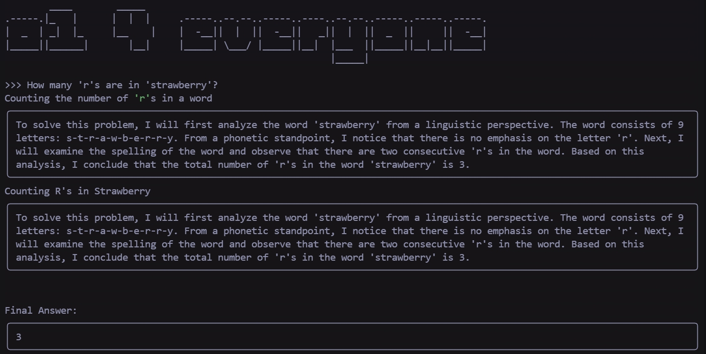

# 🍓o1 4 everyone
A reproduction of ChatGPT o1

requires python + ollama

## Usage
Just run the strctured.py.
You can control this by changing the environment variables OLLAMA_MODEL and OLLAMA_HOST.

Recommended models: QWEN2.5, GLM4, LLAMA3.1

## Requirements
ollama
rich
